# Conversation Flow — Dinner Party Planner

All possible conversation paths, including happy paths, user-driven scenarios, and error cases.

---

## Main Stage Flow

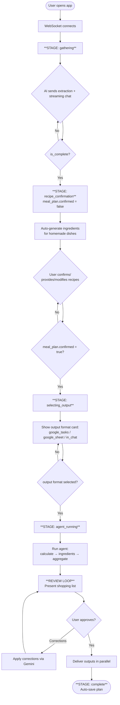

---

## Completion Gate — when does gathering end?

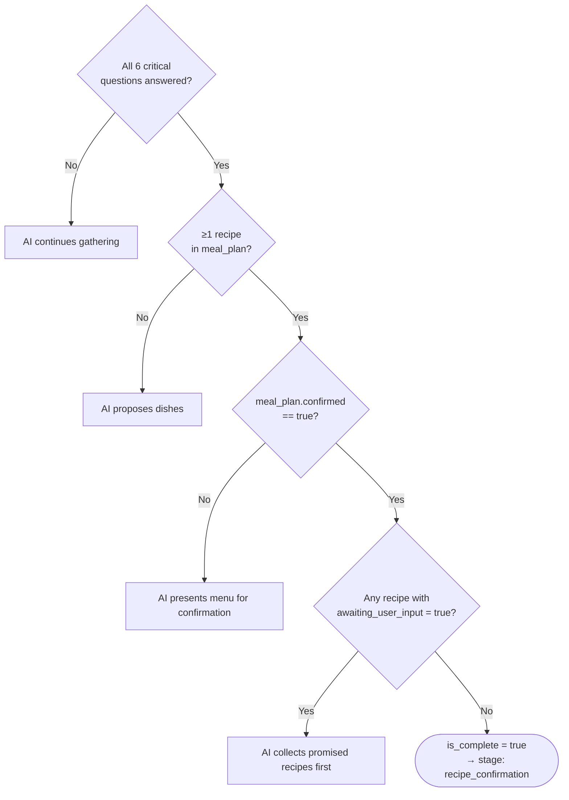

**6 critical questions:** event_type, guest_count, guest_breakdown (adults vs children), dietary restrictions, cuisine preference, meal_plan (specific dishes confirmed).

---

## Recipe Source Decision Tree

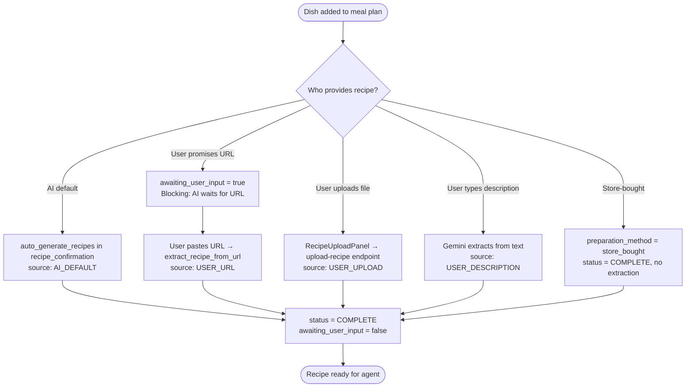

---

## Scenario A: App Chooses Everything

User gives minimal input, AI drives all decisions.

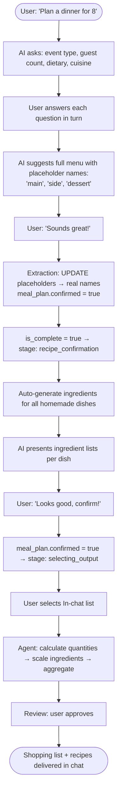

---

## Scenario B: User Provides All Recipes via URLs

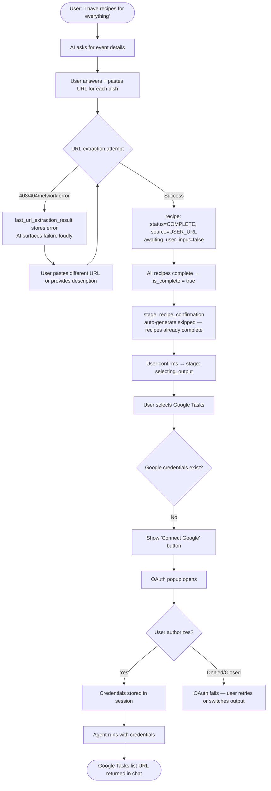

---

## Scenario C: Mixed — Some AI-Generated, Some User-Provided

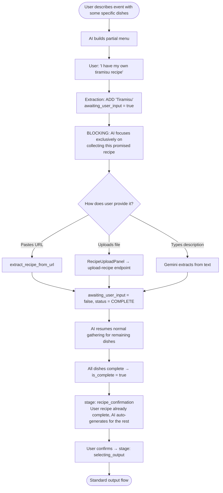

---

## Scenario D: User Modifies Menu Mid-Gathering

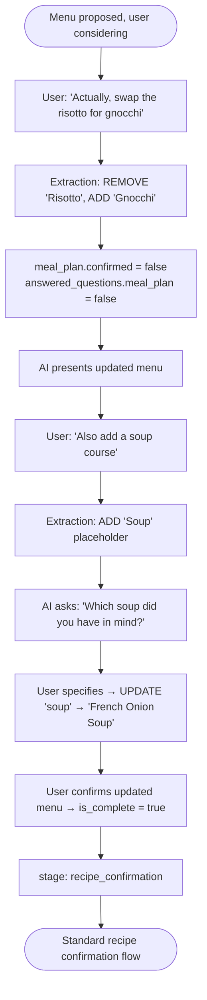

---

## Scenario E: Modifications During Recipe Confirmation

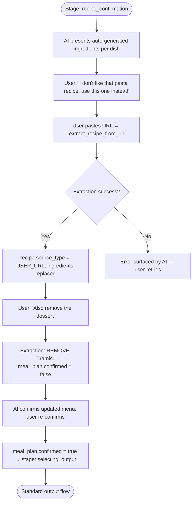

---

## Scenario F: User Wants Multiple Outputs

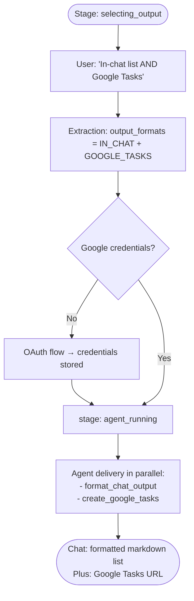

---

## Scenario G: Shopping List Corrections in Review Loop

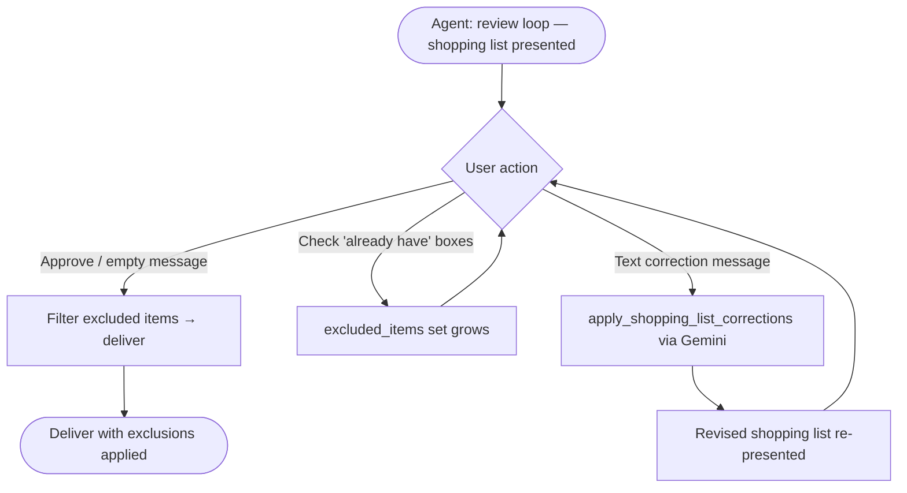

---

## Scenario H: Dietary Restrictions

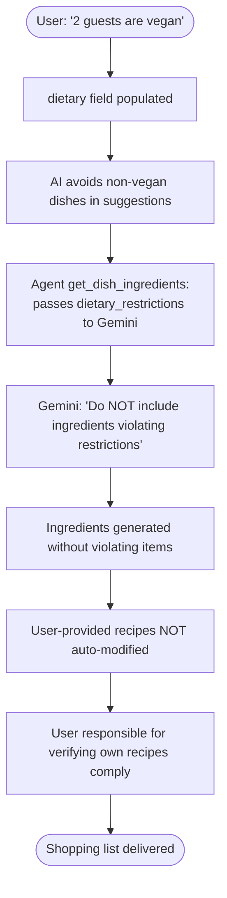

---

## Scenario I: Re-run Agent with Cached Shopping List

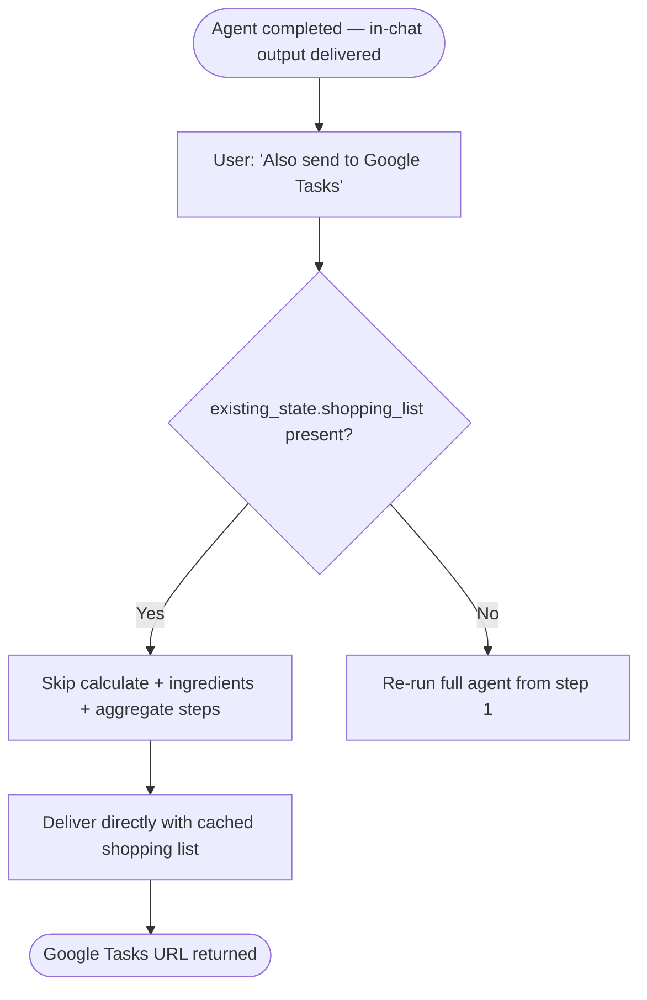

---

## Scenario J: Store-Bought Items Mixed with Homemade

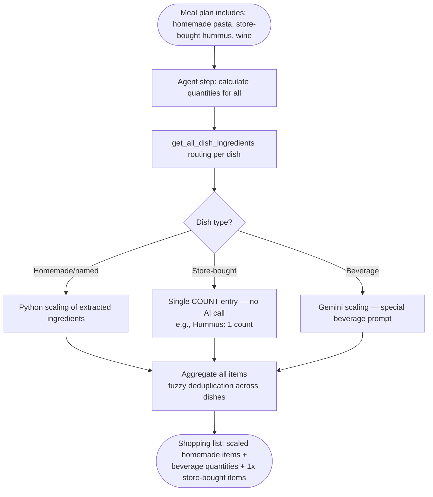

---

## Error Cases

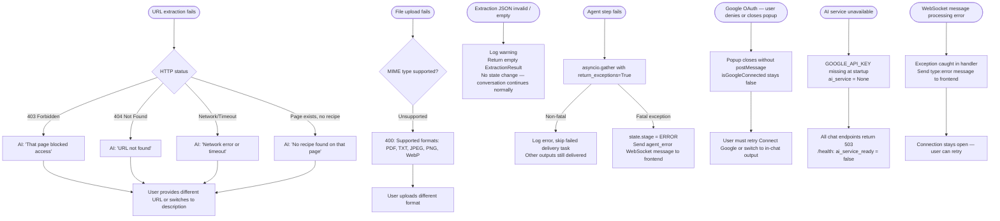

---

## Key Mechanics

| Mechanic | Trigger | Effect |
|---|---|---|
| `awaiting_user_input = true` | User promises a recipe | AI blocks on collecting it before anything else |
| `meal_plan.confirmed = false` | ADD or REMOVE action | User must re-confirm updated menu |
| `auto_generate_recipes` | Entering recipe_confirmation | AI generates ingredient lists for homemade dishes not yet provided by user |
| Confirmation reset | Any ADD/REMOVE during recipe_confirmation | `meal_plan.confirmed = false`, user must re-confirm |
| Completion score | Each extraction | 35% non-meal questions + 65% meal plan quality |
| Output format guard | `selecting_output` stage only | AI cannot extract output formats during earlier stages |
| Cached shopping list | `existing_state.shopping_list` present | Skip recalculation, jump to delivery |
